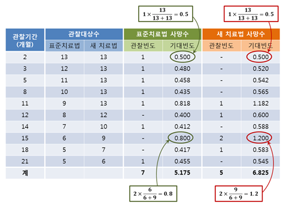

```{r setup, include=FALSE}
options(htmltools.dir.version = FALSE)
knitr::opts_chunk$set(echo = T, fig.align = "center", message = F, warning = F)
library(knitr);library(DT);library(survival);library(jstable);library(jskm);library(survsim)
colon <- na.omit(colon)
```


layout: true

<div class="my-footer"><span><a href="https://www.zarathu.com">Zarathu Co.,Ltd</a>   
&emsp;&emsp;&emsp;&emsp;&emsp;&emsp;&emsp;&emsp;&emsp;&emsp;&emsp;&emsp;&emsp;
&emsp;&emsp;&emsp;&emsp;&emsp;&emsp;&emsp;&emsp;&emsp;&emsp;&emsp;&emsp;&emsp;
<a href="https://github.com/jinseob2kim">김진섭</a></span></div> 


---
# Executive Summary 

.large[
|                      | Dafault           | Repeated measure | Survey     |
|----------------------|-------------------|------------------|------------|
| **Continuous**           | linear regression | GEE              | Survey GLM |
| **Event**                  | GLM (logistic)    | GEE              | Survey GLM |
| **Time & Event**         | Cox               | marginal Cox     | Survey Cox |
| **0,1,2,3 (rare event)** | GLM (poisson)     | GEE              | Survey GLM |

]


---
# 실습데이터 

```{r, echo=T, eval = F}
libary(survival)
data(colon)
colon
```

```{r, echo=F}
rmarkdown::paged_table(colon)

```


---
class: center, middle

# Linear regression

### Continuous


---
# Simple 

```{r, echo=F, fig.align='center'}
include_graphics("https://nextjournal.com/data/QmfPuPp4V74FyvTTojMj6ix9T8Skj1ji4GhX5Pr6zK8w4N?filename=linear-regression.png&content-type=image/png")
```

.large[
$$Y = \beta_0 + \beta_1 X + \epsilon$$
]

- 오차제곱합을 최소로하는 $\beta_0, \beta_1$ 구한다.

- $Y$ 정규분포하는 연속변수, $X$ 는 연속, 범주형 다 가능
    + $X$ 연속변수일 땐 **상관분석** 과 동일
    + $X$ 2범주일 땐 **`t.test` with 등분산** 과 동일


---

```{r}
cor.test(colon$age, colon$nodes)
summary(lm(nodes ~ age, data = colon))$coefficients
summary(glm(age ~ nodes, data = colon))$coefficients
```


---

```{r}
t.test(time ~ sex, data = colon, var.equal = T)
summary(lm(time ~ sex, data = colon))$coefficients
```


---
# 3범주 이상?

**rx**: 치료법 3개

```{r}
levels(colon$rx)
```

**더미변수로** 자동으로 바뀐 후 회귀식에 포함. 실제로는 변수 2개가 들어감

```{r}
tail(model.matrix(time ~ rx, data = colon))
```

둘다 0 이면 **Obs** (reference)


---

```{r}
summary(lm(time ~ rx, data = colon))$coefficients
```

**Obs와 Lev+5FU** 군이 유의한 차이가 있음. **ANOVA** 형태로도 볼 수 있다 (등분산 가정).

```{r}
anova(lm(time ~ rx, data = colon))
```

ANOVA p-value 는 **rx 중 튀는 것이 있는지?** 를 통합평가.  


---
# Multiple

여러 변수들을 포함 

.large[
$$Y = \beta_0 + \beta_1 X_{1} + \beta_2 X_{2} + \cdots + \epsilon$$
]

- $\beta_1$ 해석: $X_2, X_3 \cdots$ 를 보정한다면, $X_1$ 이 1 증가할 때 $Y$ 가 $\beta_1$ 만큼 증가한다.


--

```{r}
summary(lm(time ~ sex + age + rx, data = colon))$coefficients
```

.large[

논문용 테이블은 **보정 전후 결과를 같이** 보여주는 것이 대세
]

---

```{r, echo=F}
tb.linear <- glmshow.display(glm(time ~ sex + age + rx, data = colon))
out.linear <- jstable::LabelepiDisplay(tb.linear)

hide <- which(colnames(out.linear) == "sig")
datatable(out.linear, rownames=T, caption = tb.linear$first.line,
              options = c(list(columnDefs = list(list(visible=FALSE, targets =hide))
                          ),
                          list(scrollX = TRUE)
              )
    ) %>% formatStyle("sig", target = 'row',backgroundColor = styleEqual("**", 'yellow'))    
```


---

class: center, middle
# Logistic regression

### 0/1 


---

```{r, echo=F, fig.align='center'}
include_graphics("https://static.javatpoint.com/tutorial/machine-learning/images/linear-regression-vs-logistic-regression.png")
```

.large[
$$ P(Y = 1) = \frac{\exp{(X)}}{1 + \exp{(X)}}$$
]


---
# Odds Ratio

.large[


$$
\begin{aligned}
 P(Y = 1) &= \frac{\exp{(\beta_0 + \beta_1 X_1 + \beta_2 X_2 + \cdots)}}{1 + \exp{(\beta_0 + \beta_1 X_1 + \beta_2 X_2 + \cdots)}} \\\\
 \ln(\frac{p}{1-p}) &= \beta_0 + \beta_1 X_1 + \beta_2 X_2 + \cdots
\end{aligned}
$$
]

--
.large[

$\beta_1$ 해석: $X_2, X_3 \cdots$ 들 보정한다면, $X_1$이 1 증가할 때, $\ln(\frac{p}{1-p})$ 가 $\beta_1$ 만큼 증가한다.

> $\frac{p}{1-p}$ 가 $\exp(\beta_1)$ 배 증가한다. 즉 Odd Ratio =  $\exp(\beta_1)$
]


---

```{r}
summary(glm(status ~ sex + age + rx, data = colon, family = binomial))
```


---

```{r, echo=F}
tb.linear <- glmshow.display(glm(status ~ sex + age + rx, data = colon, family = binomial))
out.linear <- jstable::LabelepiDisplay(tb.linear)

hide <- which(colnames(out.linear) == "sig")
datatable(out.linear, rownames=T, caption = tb.linear$first.line,
              options = c(list(columnDefs = list(list(visible=FALSE, targets =hide))
                          ),
                          list(scrollX = TRUE)
              )
    ) %>% formatStyle("sig", target = 'row',backgroundColor = styleEqual("**", 'yellow'))    
```


---

class: center, middle
# Cox proportional hazard

### Time & Event 

---

# Time to event data

```{r, echo=F, fig.align='center'}
include_graphics("https://miro.medium.com/max/1440/1*S3lbo8tbgtklE7V-m4EsvQ.jpeg")

```

.large[
대부분 **Right censored**: XX 일에 사망 or XX 일 까지 생존
]


---

# Time to event 를 하나의 변수로 

```{r, echo=F}
rmarkdown::paged_table(data.frame(time = colon$time, status = colon$status, surv = with(colon, Surv(time, status))))

```


---
# Kaplan-meier plot

.large[
생존분석에서 table 1의 의미

- 보통 **logrank test p-value** 를 같이 보여줌.
]

```{r, fig.align='center', fig.width=6.4, fig.height=4.5, dpi=300, out.width="50%"}
jskm(survfit(Surv(time, status) ~ rx, data = colon), table = T, pval = T, marks = F)
```

---

# 계산: time 순서로 정렬


$$
\begin{aligned}
P(t) &= \frac{t \text{ 구간 생존수}}{t \text{ 시점 관찰대상 수}} : \text{구간 생존율}\\\\
S(t) & = S(t-1) \times P(t)
\end{aligned}
$$

```{r, echo=F, fig.align='center', out.width="70%"}

```

출처: https://dermabae.tistory.com/180

---

```{r, fig.align='center', fig.width=10, fig.height=7, dpi=600}
jskm(survfit(Surv(time, status) ~ rx, data = colon), table = T, pval = T, marks = F)
```

중도절단 marks 는 보통 생략.


---

```{r}
summary(survfit(Surv(time, status) ~ rx, data = colon))
```

---
# Logrank test

구간별로 예상/기대 발생 수 계산 후 합쳐서 카이제곱검정 

```{r}
survdiff(Surv(time, status) ~ rx, data = colon)
```

각 구간들의 결과를 합친다?

- 구간별 **발생 양상이 비슷**하다는 가정 (**비례위험(proportional hazards) 가정**)


---
# Cox model

.large[
Hazard function: $h(t)$

- $t$ 까진 생존하고 $t$ 직후에 사망할 가능성

Cox model: **Hazard Ratio(HR)** 을 평가


$$
\begin{aligned}
h(t) &= \exp({\beta_0 + \beta_1 X_1 + \beta_2 X_2 + \cdots}) \\\\
     &= h_0(t) \exp({\beta_1 X_1 + \beta_2 X_2 + \cdots})     
\end{aligned}
$$
$X_1$ 1 증가할 때 $h(t)$ 는 $\exp(\beta_1)$ 배 증가. 즉

$$\text{HR} = \exp{(\beta_1)}$$

]

---
# 특징

.large[
Kaplan-meier 와 마찬가지로 구간별로 통계량을 계산. 
- 구간별 양상 비슷하다는 **비례위험가정**


**Time independent HR**: 시간은 $h_0(t)$ 에만.
- 모형이 심플: HR 값이 시간에 상관없이 일정함
- Time dependent cox 도 가능.


$h_0(t)$ 는 구하지 않는다. 계산 간단해지는 장점
- Cox 가 준모수(semi-parametric) 방법이라고 불리는 이유
- 예측모형 만들땐 문제. $h_0(t)$ 를 따로 얻어야 함.

]

---

```{r}
summary(coxph(Surv(time, status) ~ sex + age + rx, data = colon))
```


---

```{r, echo=F}
res.cox <- coxph(Surv(time, status) ~ sex + age + rx, data = colon, model = T)
tb.cox <- jstable::cox2.display(res.cox, dec = 2)
#tb.cox <- jstable::LabeljsCox(tb.cox)
out.cox <- rbind(tb.cox$table, tb.cox$metric)
sig <- out.cox[, ncol(out.cox)]
sig <- gsub("< ", "", sig)
sig <- ifelse(as.numeric(as.vector(sig)) <= 0.05, "**", NA)
out.cox <- cbind(out.cox, sig)
hide <- which(colnames(out.cox) == c("sig"))
    datatable(out.cox, rownames=T, caption = tb.cox$caption,
              options = c(
                          list(columnDefs = list(list(visible=FALSE, targets= hide))
                          )
              )
    )  %>% formatStyle("sig", target = 'row',backgroundColor = styleEqual("**", 'yellow'))        
    
    
```

---
# 생존분석: 비례위험가정

.large[
트렌드 일정하다는 가정: **생존곡선 겹치면 안됨**
]
- 비례위험가정 test까진 필요없음: 그림으로 확인

<center>
</a>
</center>


---
# Landmark-analysis

.large[
시간 나눠 따로 분석]
<center>
</a>
</center>

---
# Time-dependent cox

```{r, echo=F}
vet2 <- survSplit(Surv(time, status) ~ ., data = veteran, cut=c(90, 180), episode = "tgroup", id = "id")
rmarkdown::paged_table(vet2)

```
---
# Time-dependet cox

```{r, echo=F}
vfit2 <- coxph(Surv(tstart, time, status) ~ trt + prior + karno:strata(tgroup), data=vet2)
summary(vfit2)

```


---
# Time-dependent covariate

.large[
생존분석 **모든 변수는 Index date 이전에 측정**해야
]
- 예) F/U lab, medication
.large[
Time-dependent covariate 다루려면 이를 고려한 cox 필요
]

```{r, echo=F}
N=100 #number of patients
set.seed(123)
df.tf<-simple.surv.sim(#baseline time fixed
 n=N, foltime=500,
 dist.ev=c('llogistic'),
 anc.ev=c(0.68), beta0.ev=c(5.8),
 anc.cens=1.2,
 beta0.cens=7.4,
 z=list(c("unif", 0.8, 1.2)),
 beta=list(c(-0.4),c(0)),
 x=list(c("bern", 0.5),
 c("normal", 70, 13)))
for (v in 4:7){
  df.tf[[v]] <- round(df.tf[[v]])
}
names(df.tf)[c(1,4,6,7)]<-c("id", "time", "grp","age")
df.tf <- df.tf[, -3]
 nft<-sample(1:10,
 N,replace=T)#number of follow up time points
crp<-round(abs(rnorm(sum(nft)+N,
 mean=100,sd=40)),1)
time<-NA
id<-NA
i=0
for(n in nft){
i=i+1
time.n<-sample(1:500,n)
time.n<-c(0,sort(time.n))
time<-c(time,time.n)
id.n<-rep(i,n+1)
id<-c(id,id.n)
}
df.td <- cbind(data.frame(id,time)[-1,],crp)


df <- tmerge(df.tf, df.tf, id = id, status1 = event(time, status))
df2 <- tmerge(df, df.td, id = id, crp = tdc(time, crp))
rmarkdown::paged_table(df2)
```


---
# Executive Summary 

.large[
|                      | Dafault           | Repeated measure | Survey     |
|----------------------|-------------------|------------------|------------|
| **Continuous**           | linear regression | GEE              | Survey GLM |
| **Event**                  | GLM (logistic)    | GEE              | Survey GLM |
| **Time & Event**         | Cox               | marginal Cox     | Survey Cox |
| **0,1,2,3 (rare event)** | GLM (poisson)     | GEE              | Survey GLM |

]

---
class: center, middle

# END


